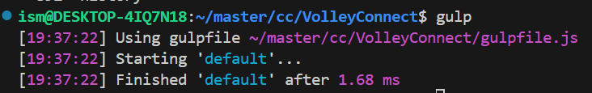
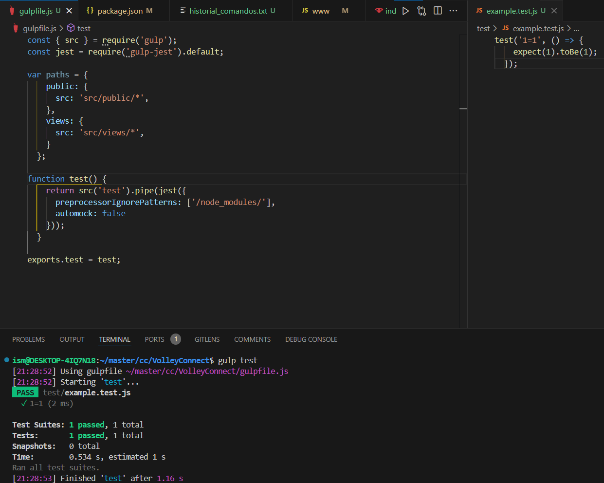
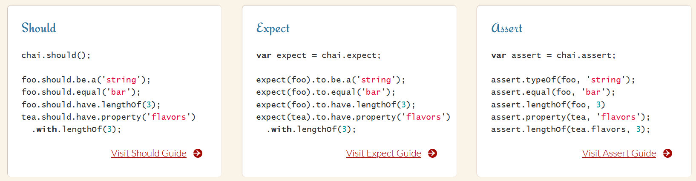
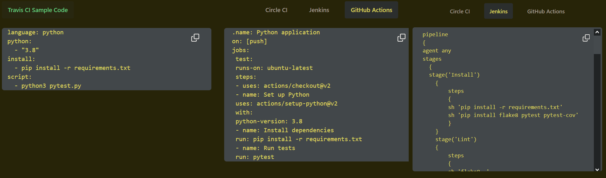
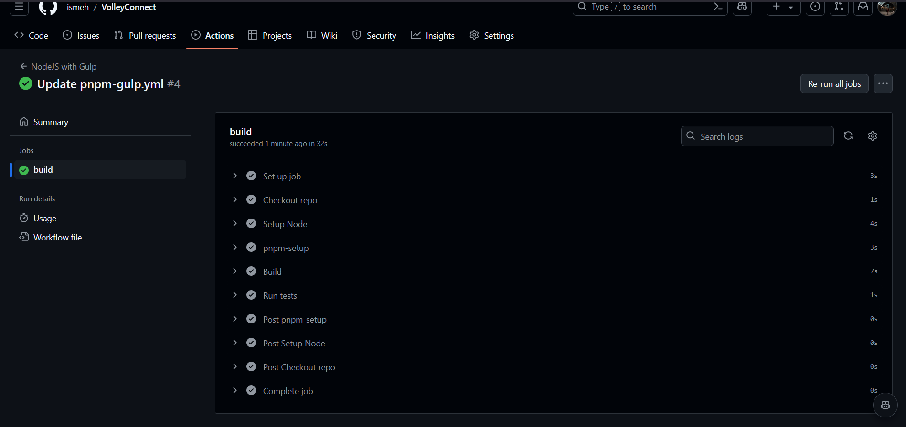

# Integración continua

## Estructura de archivos
<details>
  <summary>/root </summary>

    │
    ├── /src                # Código fuente principal
    │   ├── /config         # Configuración (DB, entorno)
    │   ├── /controllers    # Controladores de la lógica de negocio
    │   ├── /models         # Modelos de datos
    │   ├── /public         # Archivos estáticos
    │   ├── /routes         # Rutas de Express
    │   ├── /services       # Lógica de microservicios
    │   ├── /views          # Plantillas, vistas
    │   └── app.js          # Archivo principal del servidor
    │
    
    │
    ├── /tests              # Pruebas unitarias y de integración
    │
    ├── /ci                 # Scripts y configuraciones para integración continua
    │
    ├── /docker             # Configuración Docker para despliegue
    │
    ├── /docs               # Documentación del proyecto y especificaciones
    │
    ├── .env                # Variables de entorno (excluidas del repositorio)
    ├── .gitignore          # Ignorar archivos innecesarios
    │   ├── /worflows
    │       ├── pnpm-gulp.yml # Archivo de GitHub Actions
    ├── docker-compose.yml  # Configuración para orquestar servicios
    ├── [README.md](http://readme.md/)           # Descripción del proyecto
    └── package.json        # Dependencias del proyecto
</details>

## Gestor de tareas
Un gestor de tareas permite la automatización de procesos.
Para Javascript podemos encontrar los siguientes:
- **[Grunt](https://gruntjs.com/)** 
  - Configuración basada en archivos.
  - Amplia gama de plugins disponibles.
  - Comunidad activa y bien documentada.
- **[Gulp](https://gulpjs.com/)**
  - Uso de streams para una mayor velocidad.
    - Permite modificar elementos en memoria antes de escribirlos en disco para ser más eficiente.
  - Código basado en JavaScript en lugar de configuraciones.
  - Gran cantidad de plugins disponibles.
- [Rollup](https://rollupjs.org/)
  - Está pensado para unir todo el código JS en un único fichero. Este concepto es conocido como [bundle](https://keepcoding.io/blog/que-es-un-javascript-bundle/).
    - El objetivo es reducir el número de solicitudes de archivos, por lo que mejora el rendimiento y permite gestionar mejor las dependencias.
  - Soporte para ES6.
  - Generación de código optimizado.
  - Plugins para diversas funcionalidades.
- [Webpack](https://webpack.js.org/)
  - Bundler
  - Soporte para módulos ES6, CommonJS y AMD.
  - Capacidad de dividir el código en fragmentos.
  - Plugins y loaders para transformar archivos
- **[npm](https://www.npmjs.com/)/[pnpm](https://pnpm.io/es/)**
  - Scripts definidos en package.json.
  - Amplia comunidad y soporte.
  - Integración con el ecosistema de Node.js.

En Node.js principalmente se usan Grunt y Gulp.

Un debate popular cuando se habla de gestores de tareas es si estos deberían funcionar como archivos de configuración o bien como código. Cada herramienta utiliza un enfoque, por ejemplo, *grunt* es principalmente configuración, en cambio, *gulp* es sobretodo código.

Algunas de las tareas que se pueden automatizar son, la creación de documentación, el preprocesamiento de estilos, **testing**, linting (detección de errores en el código).

Finalmente voy a optar por **Gulp** debido a su eficiencia (aunque quizá también haga uso de pnpm el gestor de paquetes que estoy utilizando). 

### Instalación de Gulp
Instalamos gulp en nuestro sistema y despues como dependencia de desarrollo.
```bash
pnpm install --global gulp-cli
pnpm add --save-dev gulp
```
Tras instalarlo creamos un archivo de prueba `gulpfile.js` y ejecutamos `gulp`.


Podemos ver que funciona correctamente.

### Usando Gulp
Podemos definir tareas públicas o privadas. También podemos definir tareas para que sean ejecutadas secuencialmente o en paralelo
> Si en algún momento nuestro archivo de gulp crece demasiado podemos dividir las tareas en distintos ficheros y después importarlas en el principal. 
## Biblioteca de aserciones
Las aserciones son sentencias, predicados, contratos, que permiten indicar que ciertas condiciones deben ser ciertas dado un momento del programa.

La biblioteca de aserciones nos permitirá comparar el resultado esperado con el resultado obtenido.

Cuando hablamos de biblioteca de aserciones suele surgir el debate entre TDD(Test driven design) y BDD(Behavior-driven development).
- TDD: Metodología donde creamos las pruebas (tests) antes del desarrollo.
- BDD: Extensión de TDD que se centra en el comportamiento desde el punto de vista del usuario. Fomenta el uso de lenguaje natural para definir el comportamiento dle sistema, facilitando así la comunicación entre los desarrolladores y el resto de colaboradores.

Inicialmente pensé en utilizar un enfoque TDD ya que sería el único desarrollador del proyecto y me permitiría desarrollar de forma rápida y efectiva la implementaicón de las pruebas. Pero tras revisar algunas ofertas laborales he visto el BDD es ampliamente utilizado y es bastante intuitivo de utilizar por lo que utilizaré esta metodología.

Podemos encontrar las siguientes bibliotecas:
- **[Chai](https://www.chaijs.com/)**: Amplia y flexible, es una de las bibliotecas más comunes. Soporta estilos de aserción TDD y BDD.
  
- **[Expect](https://github.com/Automattic/expect.js)** (integrada en Jest): Ofrece aserciones intuitivas, muy útil para pruebas con Jest. Basado en Should.js
- [Should.js](https://shouldjs.github.io/): Adopta un estilo de aserción natural, haciendo el código más legible.
- [Assert (Node.js)](https://nodejs.org/api/assert.html#assert): Es básica y está incluida en Node.js, ideal para aserciones simples en scripts de servidor.

Inicialmente estaba pensando utilizar Chai ya que soporte ambos estilos de aserciones y puede ser útil para familiarizarse con ambas metodologías, finalmente escogeré Expect debido a su simplicidad y a que podemos ahorrarnos su instalación ya que viene incluida en el marco de pruebas elegido.

## Marco de pruebas
- [Mocha](https://mochajs.org/): Framework de pruebas flexible, permite integraciones con otras bibliotecas de aserciones como Chai. Es ideal si buscas personalización.
- **[Jest](https://jestjs.io/)**: Es un framework de pruebas completo, tiene aserciones, mocking y una mínima configuración inicial.
  - Los mocks son objetos o funciones simuladas.

Finalmente me decantaré por Jest ya que es un framework completo por lo que no tendré que invertir demasiado tiempo en personalización y es ampliamente usado por muchas empresas.

### Instalación de Jest
`pnpm add --save-dev jest`

## Integración continua
CI/CD, continuous integration and continuous delivery, integración continua y entrega continua ....
- **[GitHub Actions](https://github.com/features/actions)**
  - Plataforma de CI/CD que permite automatizar la construcción, los test y el despliegue de la aplicación. Se pueden crera 'workflows' que ejecuten los test cada vez que realicemos un cambio en el repositorio o incluso que despliegue en producción el resultado de una pull request aceptada.
  - Ofrece plantillas en función del código del repositorio para agilizar la puesta en marcha de la integración continua.
- [Travis CI](https://www.travis-ci.com/product/) 
 - Herramienta de CI/CD enfocada en el desarrollador.
 - Se centra en la simplicidad, a continuación podemos ver un ejemplo que compara Travis con otras herramientas:
  
 - Es de pago.
- [Jenkins](https://www.jenkins.io/)
  - Herramienta open source de automatización de servidores.
  - Permite implementar CI/CD

Finalmente he elegido GitHub actions debido a la gran documentación existente, comunidad y facilidad.

Tras crear el [archivo para especificar las acciones de GitHub](../.github/workflows/pnpm-gulp.yml) y realizar algunos arreglos la integración continua se ha integrado con [éxito](hito1.md).


### TDD
El Test Driven Desing, TDD