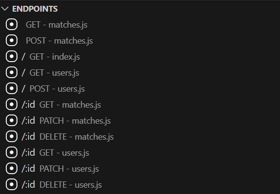
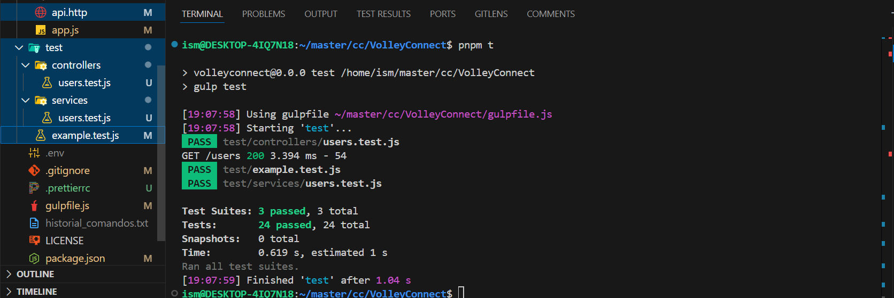

Documentación para el Hito 3: Diseño de Microservicios

1. Justificación Técnica del Framework Elegido para el Microservicio

Se eligió Express.js como framework para desarrollar el microservicio debido a su simplicidad y flexibilidad. Express proporciona una forma eficiente de definir rutas y middlewares, lo que lo convierte en una excelente opción para crear APIs REST. Además, cuenta con una amplia comunidad y un ecosistema rico en herramientas que facilitan la integración de funcionalidades adicionales, como validaciones, logs y manejo de errores. Su rendimiento y escalabilidad lo hacen ideal para proyectos que pueden crecer en complejidad, como "VolleyConnect".

Como alternativas a Express podríamos considerar NestJS que destaca como framework completo basado en TypeScript con un diseño modular, está inspirado en Angular y facilita el desarrollo de aplicaciones a gran escala, también cuenta con soporte integrado para GraphQL y WebSockets. Se suele utilizar en proyectos grandes y complejos que requieran una arquitectura sólida y modular. Por lo que no sería adecuado para este proyecto.

Por otro lado Sails.js está orientado al desarrollo rápido de APIs RESTful, incluye ORM integrado (Waterline) para manejar bases de datos, se suele utilizar cuando se necesita un framework full-stack para una aplicación con backend y frontend, en este caso nuestra prioridad era solo el backend por lo que no necesitabamos centrarnos tanto en el front.

2. Diseño de la API, Rutas, Tests y Documentación

La API de "VolleyConnect" sigue un diseño basado en REST que expone únicamente las operaciones necesarias para interactuar con los eventos de voleibol.

Se implementaron pruebas exhaustivas utilizando Jest y Supertest para verificar el correcto funcionamiento de la API. Estas pruebas cubren casos exitosos y errores esperados, también se han realizado test unitarios y test de integración.

<figure style="width: 100%">
  
  <figcaption>Ejecución de tests</figcaption>
</figure>

3. Uso de Logs para Registrar la Actividad de la API

Para los logs, se utilizaron conjuntamente Morgan y Winston:

    Morgan se emplea como middleware para registrar las solicitudes HTTP entrantes, proporcionando información básica de cada solicitud, como el método, la ruta, el código de estado y el tiempo de respuesta.
    Winston se utiliza para un registro más avanzado, permitiendo almacenar logs en archivos persistentes y configurar diferentes niveles de severidad, como info, warn y error.

Esta combinación asegura una cobertura completa del logging, capturando tanto la actividad rutinaria de la API como cualquier incidencia o error inesperado. Los logs son clave para el monitoreo en entornos de desarrollo y producción, facilitando la resolución de problemas y el análisis de comportamiento.

4. Correcta Ejecución de los Tests

La integración continua asegura que las pruebas se ejecuten automáticamente en cada cambio en el repositorio, utilizando GitHub Actions. Al ejecutar pnpm test, se verifican todas las rutas y funciones de la API. Los resultados de las pruebas, junto con un informe de cobertura, garantizan que el sistema cumple con los requisitos establecidos y que la lógica implementada está completamente cubierta.

Con este enfoque, "VolleyConnect" implementa un microservicio sólido, probando las rutas exhaustivamente, registrando la actividad de manera eficiente y garantizando la mantenibilidad y escalabilidad a futuro.
