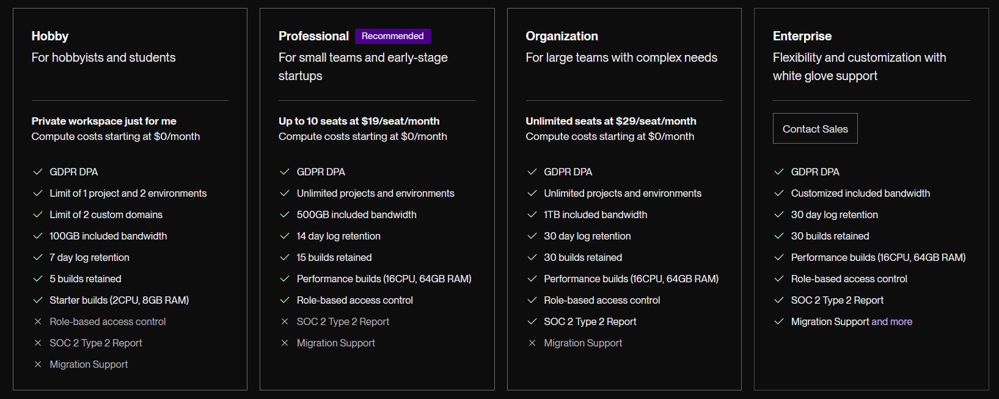
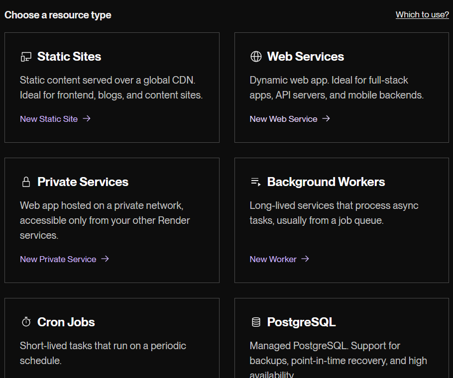
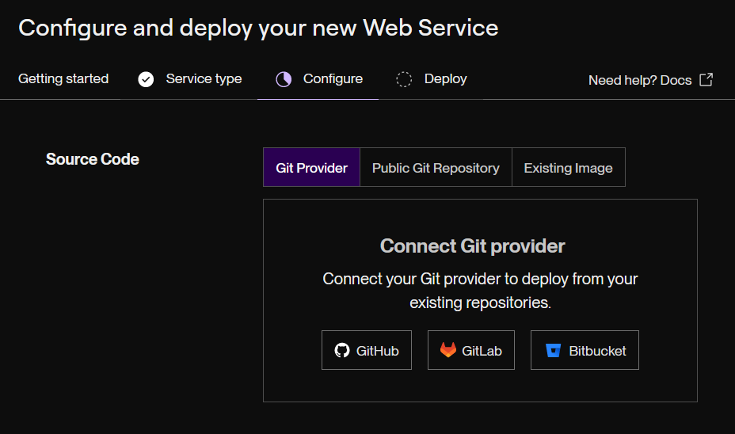
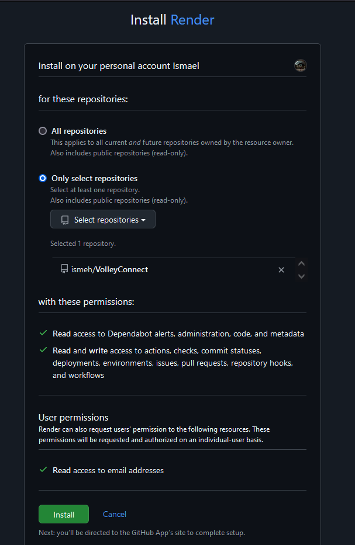
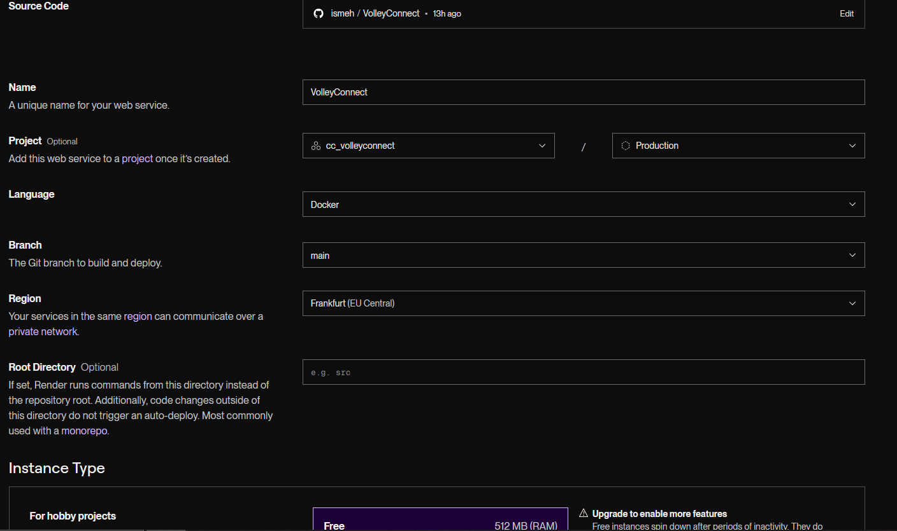
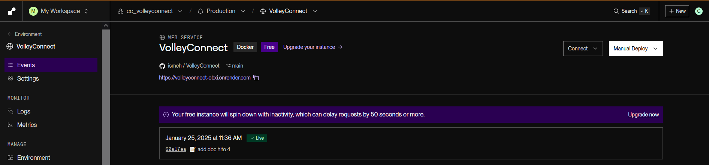
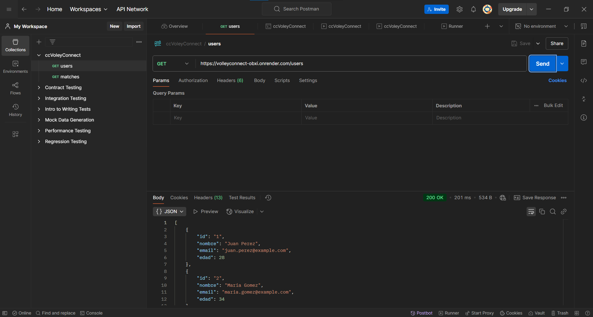
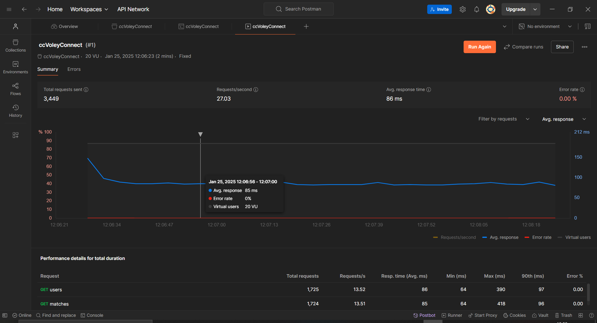
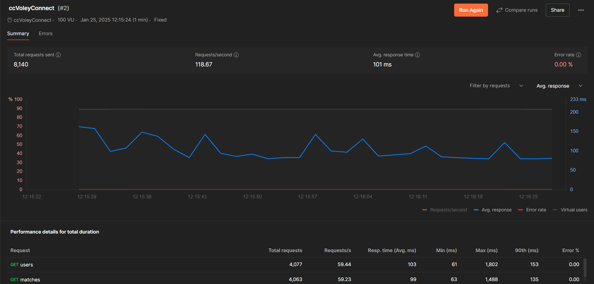
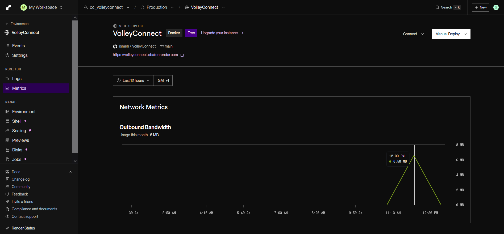

# Hito 5: Despliegue de la aplicación en un PaaS
A continuación vamos a analizar algunos de los posibles PaaS en los que podríamos desplegar nuestra aplicación.
Vamos a fijarnos en las siguientes características:
  - Despliegue directo desde GitHub: El PaaS debe permitir la integración con GitHub para hacer despliegues automáticos al hacer push.

  - Configuración mediante ficheros o CLI: Debe permitir la configuración de la infraestructura mediante un fichero de configuración o comandos CLI.

  - Despliegue en Europa: El PaaS debe cumplir con las regulaciones de la UE (por ejemplo, GDPR).

  - Gratuito o con plan gratuito: Ideal para un proyecto académico.
---
### Render
Cumple con todos los requisitos. Permite despliegue automático desde GitHub, configuración mediante ficheros (render.yaml), y tiene servidores en Europa.

### Heroku
También cumple con los requisitos, aunque su plan gratuito tiene limitaciones (como la hibernación de la aplicación después de 30 minutos de inactividad).

### Fly.io
Es una buena opción si necesitas más flexibilidad y soporte para Docker. Permite configuración mediante CLI y despliegue en Europa

---
Nos quedaremos con Render ya que es fácil de usar y tiene un plan gratuito adecuado para proyectos académicos, utilza configuraciones mediante un fichero render.yaml tiene soporta para el despliegue automático desde GitHub y cumple con las regulaciones de la UE.

Seleccionamos Web Services

Seleccionamos GitHub como fuente de nuestro código

Le damos acceso a nuestro repositorio:

Configuramos el despliegue

Finalmente podemos ver que nuestra aplicación ha sido desplegada satisfactoriamente en el PaaS [Render](https://render.com/)

## Test de rendimiento
Para evalaur el rendimiento de la aplicación he creado una cuenta en Postman y he descargado la aplicación, ya que no se pueden hacer test de rendimiento desde la interfaz web.

He empezado realizando pruebas con poca carga y la he ido incrementando conforme veía que pasaba las pruebas:

- 20 usuarios virtuales con una carga fija durante dos minutos

- 100 VU - Carga Fija - 1Min

Solo podemos simular 100 usuarios por lo que para seguir evaluando el rendimiento tendríamos que utilizar otras herramientas o solicitar respuestas más cantidad de datos.